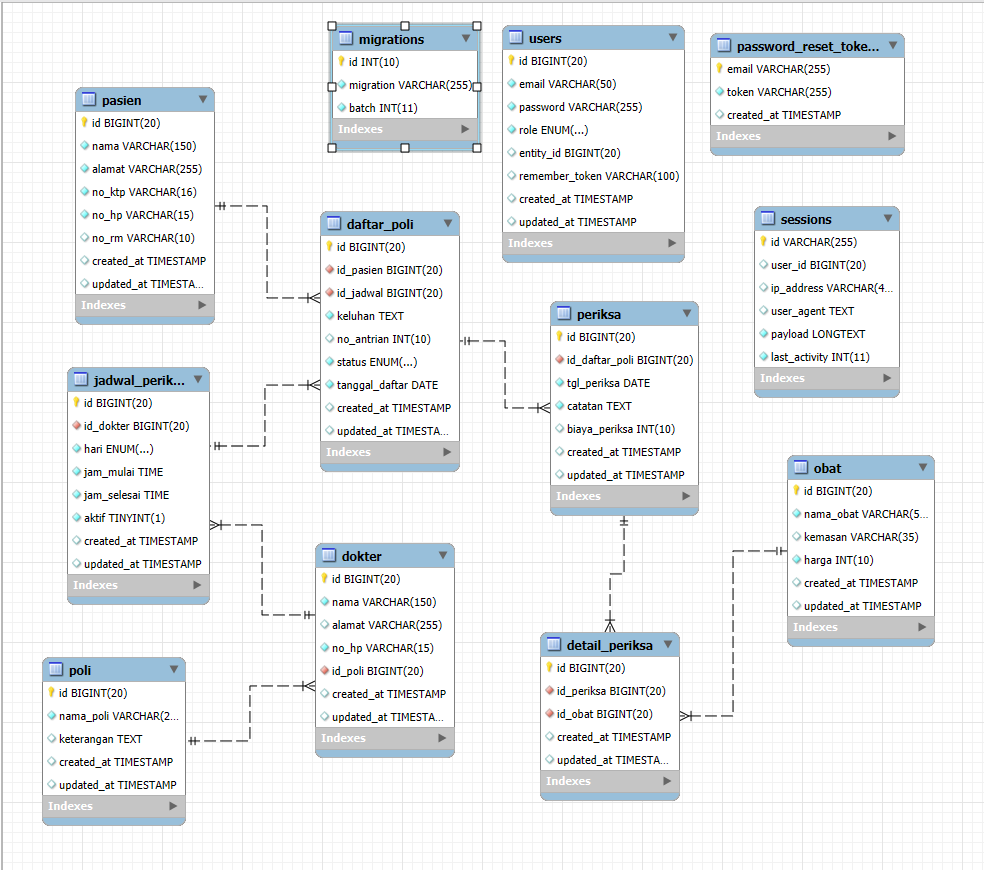

# Sistem Informasi Rumah Sakit

## Deskripsi Proyek
Sistem Informasi Rumah Sakit adalah aplikasi web berbasis Laravel yang mengelola operasional rumah sakit dengan arsitektur MVC (Model-View-Controller). Sistem ini memungkinkan pengelolaan data pasien, dokter, poli, dan obat dengan efisien.

## Arsitektur MVC

### Model
Model bertanggung jawab untuk mengelola data dan bisnis logic. Model yang tersedia:

- `User` - Mengelola data pengguna (admin, dokter, pasien)
- `Poli` - Mengelola data poliklinik
- `Dokter` - Mengelola data dokter
- `Pasien` - Mengelola data pasien
- `Obat` - Mengelola data obat
- `DaftarPoli` - Mengelola data pendaftaran pasien ke poliklinik
- `JadwalDokter` - Mengelola jadwal praktek dokter

### View
View adalah tampilan yang ditampilkan kepada pengguna. Proyek ini menggunakan:

- Blade Template Engine
- Bootstrap untuk UI/UX
- Vue.js untuk komponen interaktif
- Tailwind CSS untuk styling

### Controller
Controller mengelola logika bisnis dan menghubungkan Model dengan View. Controller yang tersedia:

- `AuthController` - Mengelola autentikasi pengguna
- `AdminController` - Mengelola operasional admin
- `DokterController` - Mengelola operasional dokter
- `PasienController` - Mengelola operasional pasien

## Fitur Utama

### 1. Sistem Autentikasi
- Login/Logout
- Registrasi pengguna baru
- Reset password
- Role-based access control (Admin, Dokter, Pasien)

### 2. Dashboard
- Dashboard admin untuk monitoring
- Dashboard dokter untuk jadwal praktek
- Dashboard pasien untuk informasi pendaftaran

### 3. Manajemen Data
- **Admin**:
  - Manajemen poliklinik
  - Manajemen dokter
  - Manajemen pasien
  - Manajemen obat

- **Dokter**:
  - Manajemen jadwal praktek
  - Pemeriksaan pasien
  - Pengelolaan resep obat
  - Profil dokter

- **Pasien**:
  - Pendaftaran pemeriksaan
  - Riwayat pemeriksaan
  - Informasi jadwal dokter

## Persyaratan Sistem

### Prerequisites
- PHP 8.1 atau lebih tinggi
- Composer
- Node.js dan npm
- MySQL/MariaDB
- Apache/Nginx
- Git

### Instalasi
1. Clone repository:
```bash
git clone [repository-url]
cd laravel-12
```

2. Install dependencies:
```bash
composer install
npm install
```

3. Copy file .env.example:
```bash
cp .env.example .env
```

4. Generate application key:
```bash
php artisan key:generate
```

5. Setup database:
```bash
php artisan migrate
php artisan db:seed
```

6. Compile assets:
```bash
npm run build
```

7. Jalankan server:
```bash
php artisan serve
```

## Database

### Struktur Database
- `users` - Data pengguna
- `polis` - Data poliklinik
- `dokters` - Data dokter
- `pasien` - Data pasien
- `obats` - Data obat
- `daftar_poli` - Data pendaftaran poliklinik
- `jadwal_dokter` - Data jadwal dokter

### ER Diagram


## Konfigurasi

### Environment Variables
Edit file `.env` untuk mengatur:
- Database connection
- Mail configuration
- Storage configuration
- Cache configuration

### Middleware
- `auth` - Proteksi route yang memerlukan autentikasi
- `role` - Proteksi route berdasarkan role pengguna
- `throttle` - Proteksi rate limiting

## Testing

### Unit Testing
```bash
php artisan test
```

### Database Testing
```bash
php artisan test --filter="Database"
```

## Deployment

### Production Deployment
1. Optimasi aplikasi:
```bash
php artisan optimize:clear
php artisan optimize
```

2. Cache configuration:
```bash
php artisan config:cache
php artisan route:cache
php artisan view:cache
```

3. Compile assets:
```bash
npm run build --production
```

## Troubleshooting

### Common Issues
1. **Database Connection Error**
   - Periksa konfigurasi database di `.env`
   - Pastikan MySQL/MariaDB sudah berjalan

2. **Route Not Found**
   - Clear route cache: `php artisan route:clear`
   - Verifikasi route di `routes/web.php`

3. **View Not Found**
   - Clear view cache: `php artisan view:clear`
   - Pastikan file view berada di direktori yang benar

## Best Practices

### Code Style
- Mengikuti PSR-12 coding standards
- Menggunakan Laravel coding conventions
- Menulis dokumentasi untuk setiap fungsi

### Security
- Menggunakan Laravel CSRF protection
- Mengimplementasikan rate limiting
- Menggunakan Laravel's built-in validation

### Performance
- Menggunakan Eloquent relationships
- Mengimplementasikan caching
- Optimizing database queries

## Kontributor

- Nama: Glen Fierre Sijabat
- NIM: A11.2022.14369
- Prodi: Teknik Informatika
- Universitas: [Nama Universitas]

## Lisensi

Project ini dilindungi oleh lisensi MIT. Lihat file LICENSE untuk detail lebih lanjut.